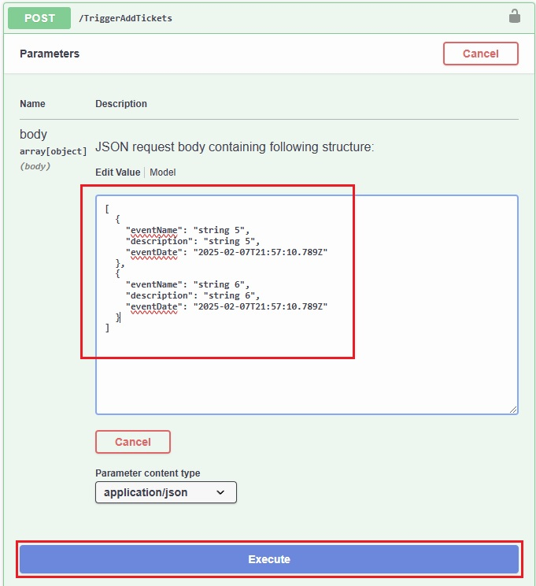
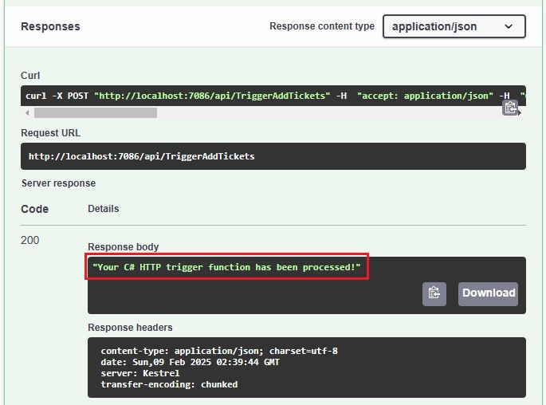

# Project C# Azure Functions V4
#### Author: Daniel Juarez

## Overview
This is a sample project in `Visual Studio 2022 Community Edition version 17.12.3` and `Azure Functions V4 worker .NET 9.0 Isolated`, that **POST** tickets to the [Web API RESTfulNetCoreWebAPI-TicketList project](https://github.com/danljuarez/cSharp-RestAPI-NetCore-TicketList) using **Http trigger** template, set **Authorization level** to **Function**. We are also going to publish this project to Azure Functions.

This project also implements:
- Azure Functions V4 following clean architecture principles.
- Dependency Injection using Microsoft.Extensions.DependencyInjection.
- Logging using Microsoft.Extensions.Logging.
- Error handling using exceptions types.
- OpenAPI extension (Swagger documentation) using Microsoft.Azure.WebJobs.Extensions.OpenApi.
- Unit testing using MS Unit Test and Moq.

## To verify by running the function locally

> **Note**: Project [Web API RESTfulNetCoreWebAPI-TicketList](https://github.com/danljuarez/cSharp-RestAPI-NetCore-TicketList) should be running locally before you run this Azure Function. To do so, follow [these instructions](https://github.com/danljuarez/cSharp-RestAPI-NetCore-TicketList?tab=readme-ov-file#to-open-and-run-the-project-from-visual-studio-2022-).

When running this function locally, the OpenAPI endpoint makes testing easy via its convenient generated page, no access keys are required.

1. Press `F5` to start the project. When Functions runtime starts locally, a set of OpenAPI and Swagger endpoints are shown in the output, along with the function endpoint.

2. In your browser, open the **RenderSwaggerUI** endpoint, which should look like: `http://localhost:7086/api/swagger/ui`. A page will be rendered, based on the OpenAPI definitions.

3. Select **POST** > **Try it out**, enter in the JSON request body values indicated (red square), and select **Execute**.

4. You'll get a response that looks like the following example:

5. You can verify your tickets have been successfully added by looking into the running `Web API RESTfulNetCoreWebAPI-TicketList` Swagger UI and selecting **GET** /api/Tickets/getAll > and then **Execute**.

## To publish this project to Azure
Now that you have verified the Azure function is running:

- You may need to [publish the Azure Functions project and API definitions to Azure](https://learn.microsoft.com/en-us/azure/azure-functions/openapi-apim-integrate-visual-studio?tabs=isolated-process#publish-the-project-to-azure) and use the name `AddTicket` instead of 'TurbineRepair' as named in this linked document steps.

- Also, you may need to [Import an Azure Function App as an API in Azure API Management](https://learn.microsoft.com/en-us/azure/api-management/import-function-app-as-api).

## Additional resources
- [Azure Functions documentation](https://learn.microsoft.com/en-us/azure/azure-functions/).
- [Serverless REST APIs using Azure Functions](https://learn.microsoft.com/en-us/azure/azure-functions/functions-proxies?source=recommendations).

 
 
Thank You.